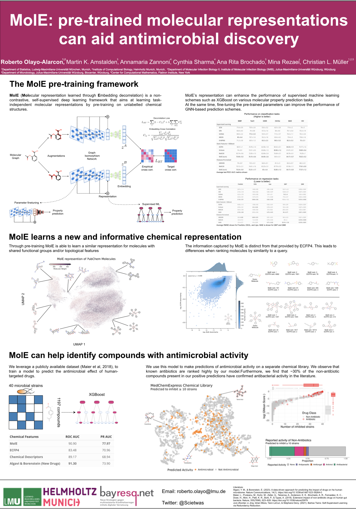
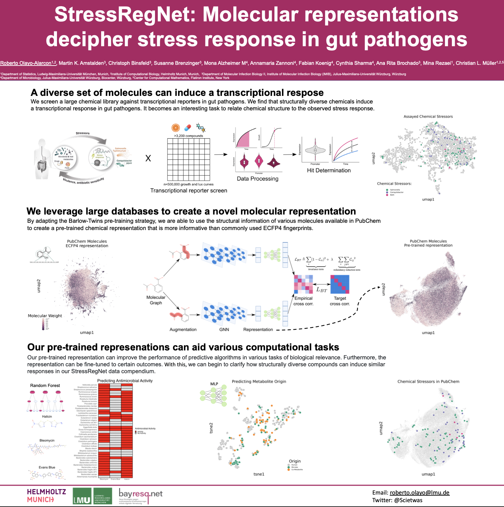
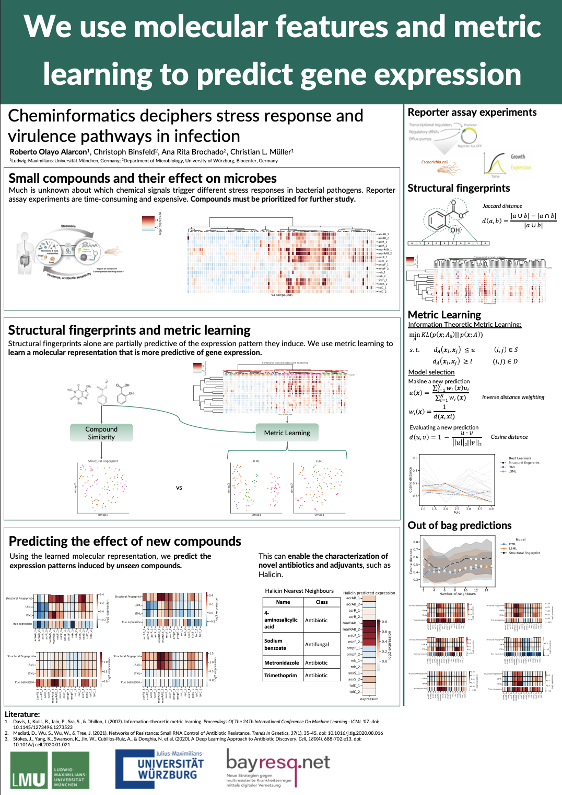
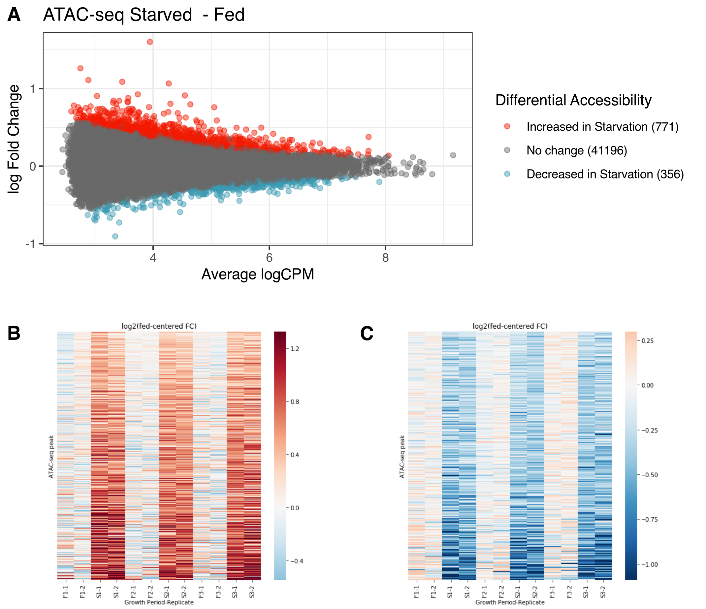

# Articles

::: callout-tip
See my [google scholar](https://scholar.google.com/citations?hl=en&user=ljY5uoMAAAAJ) for a full list of publications.
:::

1. Amstalden, M. K., **Olayo-Alarcon, R.**, ... & Brochado A. R. (2026). Large-scale screen reveals extensive regulation of intrinsic
antibiotic resistance and virulence by human-targeted drugs in Salmonella Typhimurium. [biorxiv](https://www.biorxiv.org/content/10.64898/2026.09.30.755304v1).

2. **Olayo-Alarcon, R.**, Pugno, D., Müller, C.L. (2025) Protein Content-Based Microbial Representations Improve Predictions of Antimicrobial Activity. Proceedings of the 34th International Conference on Artificial Neural Networks (ICANN 2025). Workshop on AI in Drug Discovery. <https://doi.org/10.1007/978-3-032-04552-2>.

3.  **Olayo-Alarcon, R.**, Amstalden, M. K., Zannoni, A., Bajramovic, M., Sharma, C. M., Brochado, A. R., ... & Müller, C. L. (2025). Pre-trained molecular representations enable antimicrobial discovery. [Nature Communications, 16(1), 3420](https://www.nature.com/articles/s41467-025-58804-4).
  
4. Feldl, M.\*, **Olayo-Alarcon, R.**\*, Amstalden, M. K., Zannoni, A., Peschel, S., Sharma, C. M., ... & Müller, C. L. (2025). Statistical end-to-end analysis of large-scale microbial growth data with DGrowthR. [bioRxiv](https://www.biorxiv.org/content/10.1101/2025.03.25.645164v3), 2025-03. \*co-first authors.
    
5. Binsfeld, C., **Olayo-Alarcon, R.**, Wartel, M., Stadler, M., Mueller, C., & Brochado, A. R. (2024). Systematic screen uncovers regulator contributions to chemical cues in Escherichia coli. [PLoS biology, 23(7), e3003260](https://journals.plos.org/plosbiology/article?id=10.1371/journal.pbio.3003260).
 
6. Ostner, J., Kirk, T., **Olayo-Alarcon, R.**, Thöming, J. G., Rosenthal, A. Z., Häussler, S., & Müller, C. L. (2024). BacSC: A general workflow for bacterial single-cell RNA sequencing data analysis. [bioRxiv](https://www.biorxiv.org/content/10.1101/2024.06.22.600071v1).
  
7. Stadler, M., **Olayo-Alarcon, R.**, Bien, J., & Müller, C. L. (2024). Predictive modeling of microbial data with interaction effects. [bioRxiv](https://www.biorxiv.org/content/10.1101/2024.04.29.591596v2).

8.  Dietl, A., Ralser, A., Taxauer, K., Dregelies, T., Sterlacci, W., Stadler, M., **Olayo-Alarcon, R.**, ... & Mejias Luque, R. (2024). RNF43 is a gatekeeper for colitis-associated cancer. bioRxiv, 2024-01. \[Preprint\] Available at: <https://www.biorxiv.org/content/10.1101/2024.01.30.577936v1.abstract>.

9.  Soto, L.M^\*^, **Olayo-Alarcon, R.**^\*^. et al. (2019) "GeDex: A consensus gene-disease event extraction system based on frequency patterns and supervised learning," bioRxiv \[Preprint\]. Available at: <https://doi.org/10.1101/839704>.

# Posters

## 1. MolE: Pre-trained molecular representations can aid antimicrobial discovery.

**Roberto Olayo-Alarcon**^\*^, Martin K. Amstalden, Annamaria Zannoni, et al. (2023)

Presented at **ISMB/ECCB 2023**

PDF version<a href="pdfs/ISMBECCB2023_1248_OlayoAlarcon_poster"> here</a>.

{width="600"}

## 2. StressRegNet: Molecular representations decipher stress response in gut pathogens

**Roberto Olayo-Alarcon**^\*^, Martin K. Amstalden, Annamaria Zannoni, et al. (2022)

Presented at **Keystone Symposia - Novel Approaches Against Emerging Antimicrobial Resistance**.

**AWAREDED KEYSTONE SYMPOSIA SCHOLARSHIP**.

PDF version<a href="pdfs/keystone_poster.pdf"> here</a>.

{width="600"}

## 3. Cheminformatics deciphers stress response and virulence pathways in infection

**Roberto Olayo-Alarcon**^\*^, Christoph Binsfeld, Ana Rita Brochado, Christian L. Müller. (2022)

Presented at **DAGStat 2022 - Hamburg**

PDF version<a href="pdfs/dagstat_poster_2022.pdf"> here</a>.

{width="600"}

## 4. RNF43 in colitis associated cancer.

Alisa Dietl^\*^, Mara Stadler, **Roberto Olayo-Alarcon**, et al. (2022)

Presented at **Digestive Disease Week - 2022**

## 5. Glucose starvation in Huh7 cells triggers a transcriptional memory.

Jessica A. Pellegrino^\*^, Saulius Lukauskas, **Roberto Olayo-Alarcon**, et al. (2019).

Presented at **CSH meeting: mechanisms of metabolic signaling**

# Other

## Bachelor's Thesis

Roberto Olayo Alarcón (2020) **Differential Activity of Transcriptional Regulatory Elements During Glucose Starvation**. Research Report to obtain the degree of B.Sc. in Genomic Sciences. Universidad Nacional Autónoma de México.

Full thesis<a href="pdfs/bachelor_thesis.pdf"> here</a>.

{width="600"}
